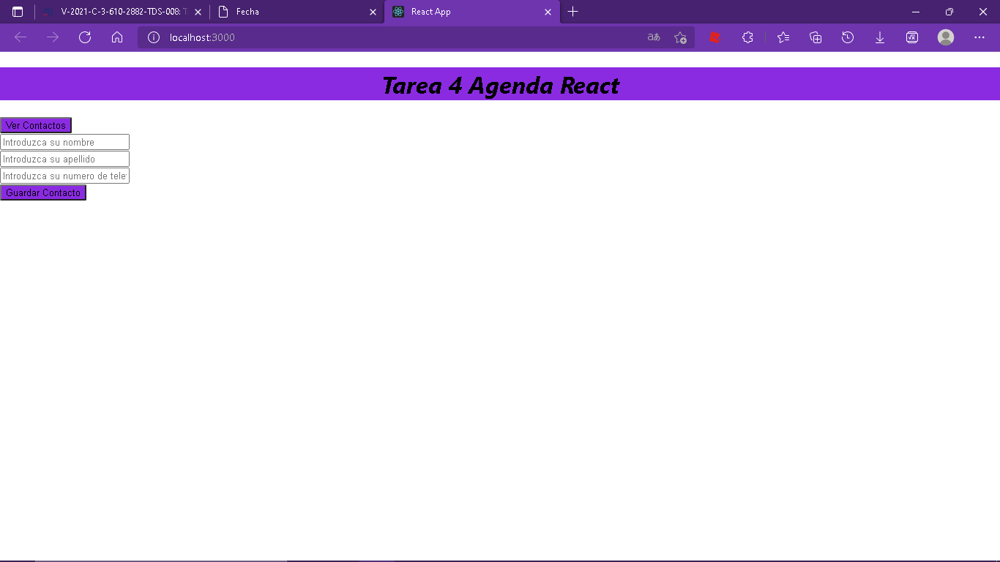
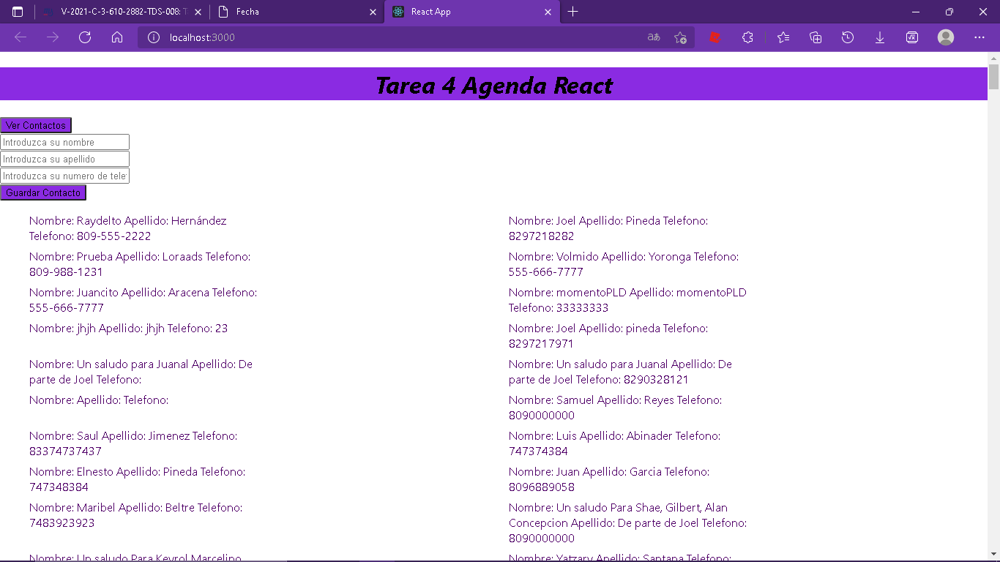
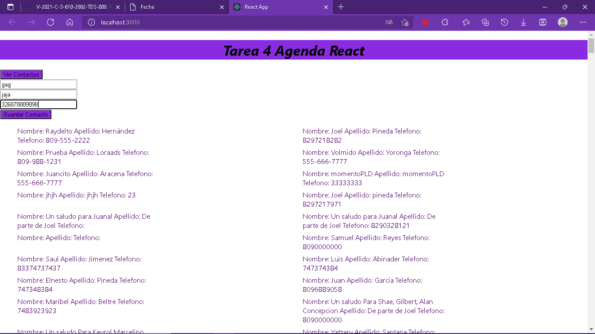
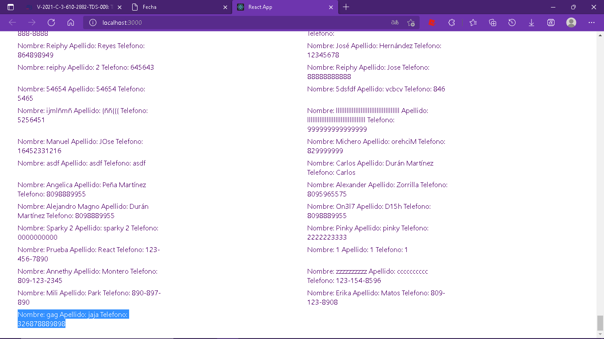

Esta es la tarea#4react de steven paredes, aqui estan las capturas

#NOTA: Cree el proyecto en VS Code con esta línea de código: npx create-react-app (y el nombre del proyecto), por esto hay algunos archivos adicionales.

1= lo primero que se ve 

2= cuando damos al boton de obtener contactos de la agenda

3= cuando agregamos un contacto nuevo

4= ver que se agrego en la lista cuando actulizamos la pagina

